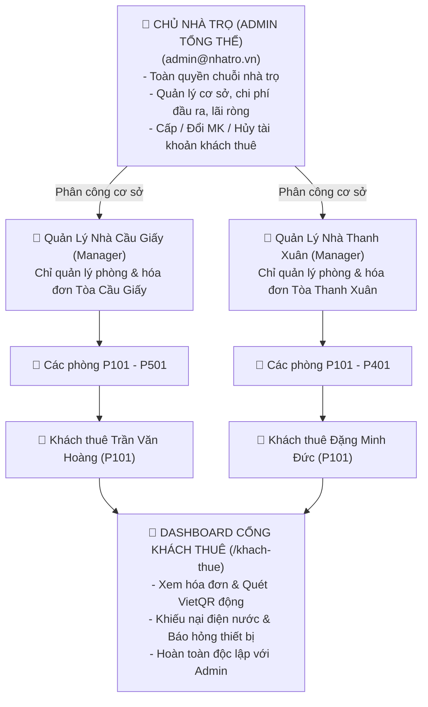

# 🏢 NhaTroPro - Hệ Thống Quản Lý Chuỗi Nhà Trọ & Căn Hộ Cho Thuê Đa Cơ Sở

<p align="center">
  
</p>

<p align="center">
  
  
  
  
  
  
</p>

---

## 📖 Giới Thiệu Dự Án

**NhaTroPro** (`phong_tro`) là hệ thống web SaaS quản lý chuỗi nhà trọ, chung cư mini và căn hộ dịch vụ cao cấp được xây dựng trên nền tảng **Laravel 10**. 

Dự án giải quyết toàn diện bài toán quản trị vận hành nhà trọ thực tế tại Việt Nam:
1. **Quản trị đa cơ sở (Multi-Property)**: Một chủ nhà trọ quản lý đồng thời nhiều tòa nhà, phân công quản lý riêng cho từng cơ sở.
2. **Phân quyền 3 cấp độc lập**: 
   - **Chủ Nhà Trọ (Admin)**: Toàn quyền hệ thống, xem tài chính lãi ròng & cấp tài khoản cho khách thuê.
   - **Quản Lý Cơ Sở (Manager)**: Bị giới hạn nghiêm ngặt (backend scope), chỉ truy cập phòng, hóa đơn và khách thuộc tòa nhà được giao.
   - **Khách Thuê Trọ (Tenant)**: Cổng Dashboard riêng biệt (`/khach-thue`), tra cứu tiền trọ, thanh toán VietQR động, gửi khiếu nại và báo hỏng đồ đạc.
3. **Mô hình tính điện nước & internet linh hoạt nhất**:
   - Tiền nước: Tính theo **đồng hồ (m³)**, theo **đầu người**, hoặc **khoán trọn gói theo phòng**.
   - Tiền mạng: **Khoán theo phòng**, tính theo **đầu người**, hoặc **miễn phí**.
4. **Chống thất thoát điện nước & tính Lợi nhuận Ròng**: So sánh điện nước EVN đầu vào tổng với điện nước thu từ các phòng; hoạch toán chi phí đầu ra (thuế, EVN, internet, rác).
5. **Quy trình Check-out & Tạm trú chuẩn pháp lý**: Kiểm tra hao mòn tài sản, hoàn trả/khấu trừ tiền cọc minh bạch; 1-click xuất danh sách đăng ký tạm trú cho Công An khu vực.

---

## 🧭 Mục Lục

- [Mô Hình Phân Quyền & Sơ Đồ Nghiệp Vụ](#-mô-hình-phân-quyền--sơ-đồ-nghiệp-vụ)
- [Tính Năng Nổi Bật](#-tính-năng-nổi-bật)
- [Tài Khoản Thử Nghiệm & Đăng Nhập 1-Click](#-tài-khoản-thử-nghiệm--đăng-nhập-1-click)
- [Công Nghệ Sử Dụng](#-công-nghệ-sử-dụng)
- [Hướng Dẫn Cài Đặt & Chạy Dự Án](#-hướng-dẫn-cài-đặt--chạy-dự-án)
- [Cấu Trúc Thư Mục Dự Án](#-cấu-trúc-thư-mục-dự-án)
- [Kiểm Thử Tự Động (PHPUnit Suite)](#-kiểm-thử-tự-động-phpunit-suite)
- [Bản Quyền & Tác Giả](#-bản-quyền--tác-giả-copyright)

---

## 👥 Mô Hình Phân Quyền & Sơ Đồ Nghiệp Vụ

### 1. Sơ Đồ Phân Quyền Vai Trò (RBAC & Scope)



### 2. Ma Trận Quyền Hạn Chi Tiết

| Chức Năng | 👑 Admin Tổng Thể | 👔 Quản Lý Cơ Sở (`manager`) | 👤 Khách Thuê (`tenant`) |
| :--- | :---: | :---: | :---: |
| **Khu vực truy cập** | `/dashboard`, `/` | `/dashboard` (Scoped) | `/khach-thue` |
| **Thêm / Sửa / Xóa Cơ Sở (Nhà Trọ)** | ✅ Toàn quyền | ❌ Chặn `403` | ❌ Chặn `403` |
| **Chi phí EVN, Nước tổng, Thuế** | ✅ Toàn quyền | ❌ Chặn `403` | ❌ Chặn `403` |
| **Báo cáo Lợi Nhuận Ròng & Thất thoát** | ✅ Xem toàn bộ | ❌ Chặn `403` | ❌ Chặn `403` |
| **Cấp / Đổi MK / Hủy tài khoản Khách** | ✅ Toàn quyền | ❌ Chặn `403` | ❌ Chặn `403` |
| **Quản lý Phòng, Hợp đồng, Khách thuê** | ✅ Toàn bộ cơ sở | 🔒 Chỉ cơ sở phụ trách | 🔒 Chỉ phòng của mình |
| **Chốt điện nước hàng loạt theo tháng** | ✅ Toàn bộ cơ sở | 🔒 Chỉ cơ sở phụ trách | ❌ Không có quyền |
| **Thanh toán VietQR động** | ✅ Xem hóa đơn | ✅ Xem hóa đơn | ✅ Quét mã thanh toán |
| **Gửi phản hồi khiếu nại / Báo hỏng** | 📥 Tiếp nhận & Trả lời | 📥 Tiếp nhận & Trả lời | 📤 Gửi yêu cầu |

---

## 🚀 Tính Năng Nổi Bật

### 1. Quản Lý Đa Cơ Sở & Chuỗi Nhà Trọ (`Property`)
- Quản lý nhiều tòa nhà / dãy trọ khác nhau trên cùng một hệ thống.
- Cấu hình số tầng, mã công tơ điện lực EVN, mã đồng hồ cấp nước sạch.
- Tích hợp tài khoản ngân hàng thụ hưởng (MBBank, Techcombank...) để sinh VietQR thu tiền tự động.
- Thiết lập quy chuẩn tính tiền nước và tiền internet mặc định cho toàn cơ sở.

### 2. Quản Lý Phòng Trọ & Dịch Vụ Đi Kèm (`Room` & `RoomFee`)
- Quản lý phòng theo số phòng, tầng lầu, diện tích, giá thuê, số người ở tối đa.
- Bộ lọc thông minh và **Công cụ tìm nhanh phòng trống** (`/rooms/vacant-finder`).
- **Danh mục tài sản nội thất** gắn theo từng phòng: Tình trạng (mới 100%, tốt), giá trị tài sản phục vụ kiểm kê khi check-out.
- **Tính tiền nước đa dạng**:
  - `meter`: Theo số đồng hồ thực tế `(Số mới - Số cũ) × Đơn giá/m³`.
  - `per_person`: Theo số người ở thực tế `(Đại diện + thành viên ở ghép) × Đơn giá/người`.
  - `fixed_room`: Khoán cố định trọn gói cả phòng.
- **Tính tiền mạng internet đa dạng**:
  - `fixed`: Khoán cố định theo phòng (ví dụ: 100.000đ/tháng).
  - `per_person`: Tính theo đầu người (ví dụ: 50.000đ/người/tháng).
  - `free`: Miễn phí (0đ).

### 3. Khách Thuê & Đăng Ký Tạm Trú Công An (`Tenant`)
- Quản lý CCCD/CMND, ngày cấp, nơi cấp, quê quán thường trú, số điện thoại, biển số xe.
- Theo dõi tình trạng đăng ký tạm trú: *Đã đăng ký / Chưa đăng ký*.
- **Xuất báo cáo danh sách tạm trú** phục vụ khai báo trực tiếp với Công An phường/xã.
- **Cấp tài khoản đăng nhập cho khách**: Admin tạo tài khoản để khách đăng nhập ứng dụng, xem hóa đơn và nhận thông báo.

### 4. Hợp Đồng Thuê & Quy Trình Trả Phòng Check-Out (`Contract`)
- Ghi nhận tiền cọc, giá thuê, thời hạn thuê, đại diện ký hợp đồng và các thành viên ở ghép.
- **In hợp đồng thuê trọ tiêu chuẩn** (`/contracts/{id}/print`).
- **Quy trình Check-out & Thanh lý hợp đồng chuyên nghiệp** (`/contracts/{id}/checkout`):
  - Chốt chỉ số điện, nước ngày trả phòng.
  - Kiểm tra hư hao tài sản và tính chi phí bồi thường.
  - Tự động cấn trừ công nợ vào tiền cọc để tính chính xác số tiền cần hoàn trả hoặc thu thêm của khách.

### 5. Lập Hóa Đơn Hàng Loạt & Thanh Toán VietQR (`Invoice`)
- **Chốt số điện nước hàng loạt** (`/invoices/bulk-create`): Giao diện nhập bảng nhanh cho toàn bộ phòng trong tòa nhà chỉ trong 2 phút.
- Tự động nhận diện công thức: nếu phòng tính theo đầu người sẽ tự nhân số người ở thực tế; nếu tính theo đồng hồ sẽ kiểm tra chỉ số tiêu thụ.
- **Mã VietQR động**: Tự động sinh mã QR chuẩn Napas247 chứa đúng số tài khoản chủ nhà, tên chủ tài khoản, số tiền và cú pháp chuyển khoản chính xác.
- In phiếu thu tiền trọ bản in giấy đẹp mắt.
- Ghi nhận thanh toán linh hoạt: Chuyển khoản / Tiền mặt, thanh toán một phần hoặc toàn bộ.

### 6. Chi Phí Nhà Nước & Báo Cáo Lợi Nhuận Ròng (`PropertyExpense` & `FinancialReport`)
- Quản lý các dòng tiền chi ra trả cho Nhà nước và vận hành: Điện EVN tổng, Nước sạch tổng, Thuế môn bài/thuế khoán, Internet nhà mạng, Rác thải, Sửa chữa lớn.
- **Báo cáo tài chính & Thất thoát**:
  - Đối soát số điện/nước tổng mà EVN/Công ty nước sạch thu so với tổng số điện/nước thu lẻ từ các phòng -> Phát hiện rò rỉ hoặc câu trộm điện nước.
  - Báo cáo Lợi nhuận Ròng: `Doanh thu thực thu - Tổng chi phí vận hành`.

### 7. Cổng Riêng Cho Khách Thuê Trọ (Tenant Portal - `/khach-thue`)
- Giao diện Dashboard độc lập dành cho người thuê trọ.
- Bảng kê hóa đơn phân chia rõ: *Đang Chờ Nộp, Quá Hạn Nộp, Lịch Sử Đã Nộp*.
- Chi tiết hóa đơn riêng biệt (`/tra-cuu/{code}`) có mã VietQR để chuyển khoản ngay.
- Khách thuê gửi khiếu nại khi thấy tiền điện nước bất thường; chủ nhà phản hồi trực tiếp trên hệ thống.
- Khách thuê gửi yêu cầu báo hỏng thiết bị (cháy đèn, hỏng điều hòa, tắc vòi sen) để chủ nhà điều phối thợ sửa chữa.

---

## 🔑 Tài Khoản Thử Nghiệm & Đăng Nhập 1-Click

Hệ thống có sẵn tính năng **1-Click Quick Login** tại trang đăng nhập:  
👉 **[http://127.0.0.1:8086/login](http://127.0.0.1:8086/login)**

| Vai Trò | Email Đăng Nhập | Mật Khẩu | Quyền Hạn & Phạm Vi |
| :--- | :--- | :---: | :--- |
| 👑 **Chủ Nhà Trọ (Admin)** | `admin@nhatro.vn` | `123456` | Toàn quyền toàn hệ sinh thái, đa cơ sở, quản lý tài chính lãi ròng, cấp tài khoản khách |
| 👔 **Quản Lý Cầu Giấy (Manager)** | `quanly.caugiay@nhatro.vn` | `123456` | Quản lý phòng trọ, khách thuê, hóa đơn của Tòa Green House Cầu Giấy |
| 👔 **Quản Lý Thanh Xuân (Manager)** | `quanly.thanhxuan@nhatro.vn` | `123456` | Quản lý phòng trọ, khách thuê, hóa đơn của Khu Căn hộ Mini Thanh Xuân |
| 🏠 **Khách Thuê Trọ (Tenant)** | `hoang.tran@gmail.com` | `123456` | Đăng nhập chuyển thẳng vào Cổng Khách Thuê, xem P.101 Cầu Giấy |

---

## 🛠️ Công Nghệ Sử Dụng

- **Backend**: [Laravel 10](https://laravel.com/) (PHP 8.1 / 8.2+)
- **Database**: SQLite (Mặc định cho môi trường chạy thử nhẹ nhàng) hoặc MySQL / MariaDB / PostgreSQL
- **Frontend**: Blade Template Engine, [Bootstrap 5.3](https://getbootstrap.com/), [Bootstrap Icons 1.11](https://icons.getbootstrap.com/)
- **QR Payment**: Tích hợp API VietQR (chuẩn VietQR / Napas247 Quick Response)
- **Testing**: PHPUnit 10 (42 Feature & Unit Tests tự động)

---

## 💻 Hướng Dẫn Cài Đặt & Chạy Dự Án

### 1. Yêu Cầu Môi Trường
- PHP >= 8.1 (Khuyến nghị PHP 8.2)
- Các extension PHP bắt buộc: `pdo_sqlite` (hoặc `pdo_mysql`), `mbstring`, `openssl`, `curl`, `xml`, `fileinfo`
- [Composer](https://getcomposer.org/) (phiên bản 2.x)
- Git

### 2. Các Bước Cài Đặt

#### Bước 1: Clone mã nguồn về máy
```bash
git clone https://github.com/Khanh309/phong_tro.git
cd phong_tro
```

#### Bước 2: Cài đặt các thư viện PHP qua Composer
```bash
composer install
```

#### Bước 3: Thiết lập tệp cấu hình môi trường (.env)
Sao chép tệp mẫu sang `.env`:
```bash
cp .env.example .env
```
*(Trên Windows PowerShell có thể dùng: `copy .env.example .env`)*

Tạo mã khóa ứng dụng (Application Key):
```bash
php artisan key:generate
```

#### Bước 4: Khởi tạo Cơ sở Dữ liệu & Nạp Dữ liệu Mẫu

**Cách 1: Sử dụng SQLite (Đơn giản nhất, không cần cài đặt MySQL):**
Tệp `.env`:
```ini
DB_CONNECTION=sqlite
```
Tạo tệp SQLite và nạp dữ liệu mẫu:
```bash
# Tạo file sqlite nếu chưa có
touch database/database.sqlite

# Chạy migration và nạp seed dữ liệu mẫu phong phú
php artisan migrate:fresh --seed
```

**Cách 2: Sử dụng MySQL:**
Tạo một cơ sở dữ liệu mới trong MySQL (ví dụ `phong_tro`), sau đó cấu hình trong `.env`:
```ini
DB_CONNECTION=mysql
DB_HOST=127.0.0.1
DB_PORT=3306
DB_DATABASE=phong_tro
DB_USERNAME=root
DB_PASSWORD=your_password
```
Chạy migration và seed:
```bash
php artisan migrate:fresh --seed
```

#### Bước 5: Khởi chạy máy chủ nội bộ
```bash
php artisan serve --port=8086
```
Truy cập trình duyệt tại: **[http://127.0.0.1:8086](http://127.0.0.1:8086)**

---

## 📂 Cấu Trúc Thư Mục Dự Án

```text
phong_tro/
├── app/
│   ├── Http/
│   │   ├── Controllers/
│   │   │   ├── AuthController.php            # Đăng nhập, đăng xuất, phân quyền
│   │   │   ├── DashboardController.php       # Bảng điều khiển trung tâm theo vai trò
│   │   │   ├── PropertyController.php        # Quản lý cơ sở / chuỗi nhà trọ (Admin)
│   │   │   ├── RoomController.php            # Quản lý phòng trọ, tài sản & phí
│   │   │   ├── TenantController.php          # Quản lý khách, tạm trú & cấp tài khoản
│   │   │   ├── ContractController.php        # Hợp đồng, in ấn & quy trình check-out
│   │   │   ├── InvoiceController.php         # Lập hóa đơn hàng loạt, VietQR, thu tiền
│   │   │   ├── PropertyExpenseController.php # Chi phí EVN, nước tổng, thuế (Admin)
│   │   │   ├── FinancialReportController.php # Báo cáo tài chính & thất thoát (Admin)
│   │   │   ├── MaintenanceController.php     # Xử lý báo hỏng thiết bị & điều phối thợ
│   │   │   └── TenantPortalController.php    # Cổng Dashboard riêng cho khách thuê
│   │   └── Middleware/
│   │       ├── EnsureAdmin.php               # Chặn truy cập phi-Admin vào quản lý cơ sở/thuế
│   │       └── EnsureStaff.php               # Chặn tài khoản khách thuê vào trang quản trị
│   └── Models/
│       ├── User.php                          # Người dùng (admin, manager, tenant)
│       ├── Property.php                      # Cơ sở nhà trọ
│       ├── Room.php                          # Phòng trọ & thuật toán tính điện nước/mạng
│       ├── RoomFee.php                       # Phí dịch vụ gắn với phòng
│       ├── RoomAsset.php                     # Tài sản nội thất gắn với phòng
│       ├── Tenant.php                        # Khách thuê trọ
│       ├── Contract.php                      # Hợp đồng thuê phòng
│       ├── ContractMember.php                # Thành viên ở cùng / ở ghép
│       ├── Invoice.php                       # Hóa đơn thanh toán hàng tháng
│       ├── InvoiceFeedback.php               # Khiếu nại hóa đơn của khách thuê
│       ├── PropertyExpense.php               # Chi phí đầu ra trả cho Nhà nước
│       └── MaintenanceRequest.php            # Yêu cầu bảo trì / báo hỏng thiết bị
├── database/
│   ├── migrations/                           # Lịch sử lược đồ cơ sở dữ liệu
│   └── seeders/
│       └── DatabaseSeeder.php                # Dữ liệu mẫu chuẩn thực tế chuỗi nhà trọ
├── resources/
│   └── views/
│       ├── layouts/
│       │   ├── app.blade.php                 # Layout quản trị Admin & Manager
│       │   └── tenant.blade.php              # Layout chuyên biệt cho Khách Thuê
│       ├── auth/                             # Giao diện Đăng nhập & 1-Click Demo
│       ├── dashboard/                        # Bảng điều khiển KPI & thống kê
│       ├── properties/                       # Quản lý cơ sở nhà trọ
│       ├── rooms/                            # Danh sách phòng & tìm phòng trống
│       ├── tenants/                          # Hồ sơ khách, tạm trú & quản lý tài khoản
│       ├── contracts/                        # Quản lý hợp đồng & mẫu in, check-out
│       ├── invoices/                         # Danh sách hóa đơn, chốt số & in ấn
│       ├── expenses/                         # Quản lý chi phí đầu ra
│       ├── reports/                          # Báo cáo tài chính & đối soát điện nước
│       ├── maintenance/                      # Quản lý sửa chữa, báo hỏng
│       └── portal/                           # Cổng Dashboard & chi tiết HĐ khách thuê
└── tests/
    └── Feature/                              # Bộ kiểm thử tự động toàn diện
        ├── RoleBasedAccessControlTest.php    # Kiểm thử phân quyền 3 vai trò
        ├── TenantAccountAndFeeTest.php       # Kiểm thử cấp tài khoản & tính điện nước
        ├── TenantFeedbackAndPortalTest.php   # Kiểm thử Cổng khách thuê & khiếu nại
        ├── RentalBusinessLogicTest.php       # Kiểm thử nghiệp vụ thuê phòng & check-out
        └── RentalSystemTest.php              # Kiểm thử giao diện & luồng hệ thống
```

---

## 🧪 Kiểm Thử Tự Động (PHPUnit Suite)

Dự án bao gồm bộ kiểm thử tự động toàn diện với **42 test case** bao phủ từ phân quyền, nghiệp vụ hợp đồng đến tính toán điện nước:

```bash
php vendor/bin/phpunit
```

Kết quả kiểm thử thực tế:
```text
PHPUnit 10.5.64 by Sebastian Bergmann and contributors.

Runtime:       PHP 8.2.12
Configuration: D:\demo_gemini\phpunit.xml

..........................................                        42 / 42 (100%)

Time: 00:01.535, Memory: 36.00 MB

OK (42 tests, 164 assertions)
```

---

## 🛡️ Bản Quyền & Tác Giả (Copyright)

- **Tác giả & Nhà phát triển**: **Lê Duy Khánh** ([@Khanh309](https://github.com/Khanh309))
- **Bản quyền**: © 2026 **Lê Duy Khánh**. Toàn quyền bảo lưu (**All Rights Reserved**).
- **Quy định bản quyền & Nghiêm cấm sao chép**:
  - Toàn bộ mã nguồn, kiến trúc hệ thống, cơ sở dữ liệu và giao diện của dự án là **tài sản trí tuệ độc quyền của Lê Duy Khánh**.
  - **NGHIÊM CẤM** bất kỳ cá nhân, tổ chức nào sao chép, trích xuất, chỉnh sửa, tái phân phối hoặc thương mại hóa mã nguồn dự án dưới bất kỳ hình thức nào khi chưa có sự cho phép bằng văn bản từ tác giả **Lê Duy Khánh**.
  - Mọi hành vi tự ý sao chép, sử dụng mã nguồn mà không có sự đồng ý của tác giả đều là **hành vi xâm phạm quyền tác giả và sở hữu trí tuệ** và sẽ bị xử lý theo quy định của pháp luật.

---

<p align="center">
  Dự án được nghiên cứu, phát triển và sở hữu độc quyền bởi <b>Lê Duy Khánh</b>.
</p>
